  

> **CLASSIFIED OPERATION:** PHISHING CAMPAIGN DECONSTRUCTION & IOC EXTRACTION  
> **STATUS:** CONCLUDED | **AUTHOR:** MR. CIPHER-X [C|THE]

 

### 🛡️ Operation Abstract

This repository details the comprehensive forensic analysis of a targeted phishing campaign. The operation involved extracting raw email headers, tracing spoofed sender origins, sandboxing malicious payloads, and identifying credential-harvesting infrastructure to develop actionable threat intelligence.

---

### ⚙️ Attack Vector & Analysis Flow

```mermaid
graph TD;
    A[Suspicious Email] --> B{Header Analysis};
    B -->|SPF/DKIM/DMARC Failure| C[Identify Spoofed Origin];
    A --> D{Payload Extraction};
    D -->|Embedded URL| E[URL Sandboxing / Defanging];
    D -->|Attachment| F[Static/Dynamic Malware Analysis];
    C --> G[Extract Origin IP & Domain];
    E --> H[Identify Phishing Kit / C2];
    F --> I[Extract File Hashes];
    G --> J[Compile IOCs & Mitigation Rules];
    H --> J;
    I --> J;
    
    style A fill:#1a1a1a,stroke:#00FFFF,stroke-width:2px;
    style J fill:#1a1a1a,stroke:#8A2BE2,stroke-width:2px;
```

---

### 🦠 Threat & Mitigation Matrix

| **Threat Vector** | **Indicators of Compromise (IOCs)** | **Analysis Technique** | **Tactical Mitigation / Response** |
| :--- | :--- | :--- | :--- |
| **Sender Spoofing** | Forged `Return-Path` & failed DMARC | Email Header Inspection | Block source IP at Secure Email Gateway (SEG). |
| **Credential Harvester** | Obfuscated URL directing to fake login | OSINT & URL Defanging | Blacklist domain & update proxy filtering rules. |
| **Weaponized Payload** | Malicious `.pdf` or `.docx` attachment | Sandbox Execution (e.g., Any.Run) | Extract SHA-256 hash, update EDR definitions. |

---

### 📸 Digital Evidence Board

*(Note: PII and sensitive target data have been redacted. The following evidence represents extracted threat intelligence.)*

  <!-- NOTE: REPLACE THESE SRC LINKS WITH YOUR ACTUAL GITHUB IMAGE PATHS -->
  
  &nbsp; &nbsp;
  

---

  <code>[ OPERATION TERMINATED - THREAT INTEL EXTRACTED ]</code>

